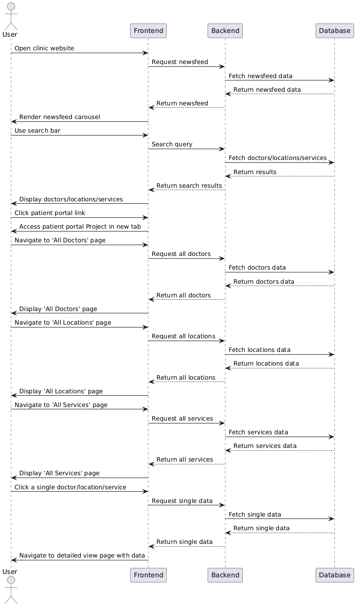

# Mock Clinic Website - Work in Progress

- **React**
- **TypeScript**
- **Cypress** (testing)
- **Tailwind CSS** 
- **Redux Toolkit**

## Features (In progress)
- Responsive frontend using **React** and **Tailwind CSS**
- State management and API interactions with **Redux Toolkit**
- e2e/integration testing with **Cypress**

## Mobile Design (Figma)
 

## Destop Design (Figma)

 

Note: Minor tweaks will be made. The final implementation will closelly resemble the preview shown. 

## Sequence Diagram (PlantUML)

Note: Diagram may evolve as new features are introduced.

## Acknowledgments

This project was inspired by [UCLA Health](https://www.uclahealth.org), specifically the design and functionality of the navbar. All code was created from scratch.

## Getting Started

### `npm install`

### `npm start`

